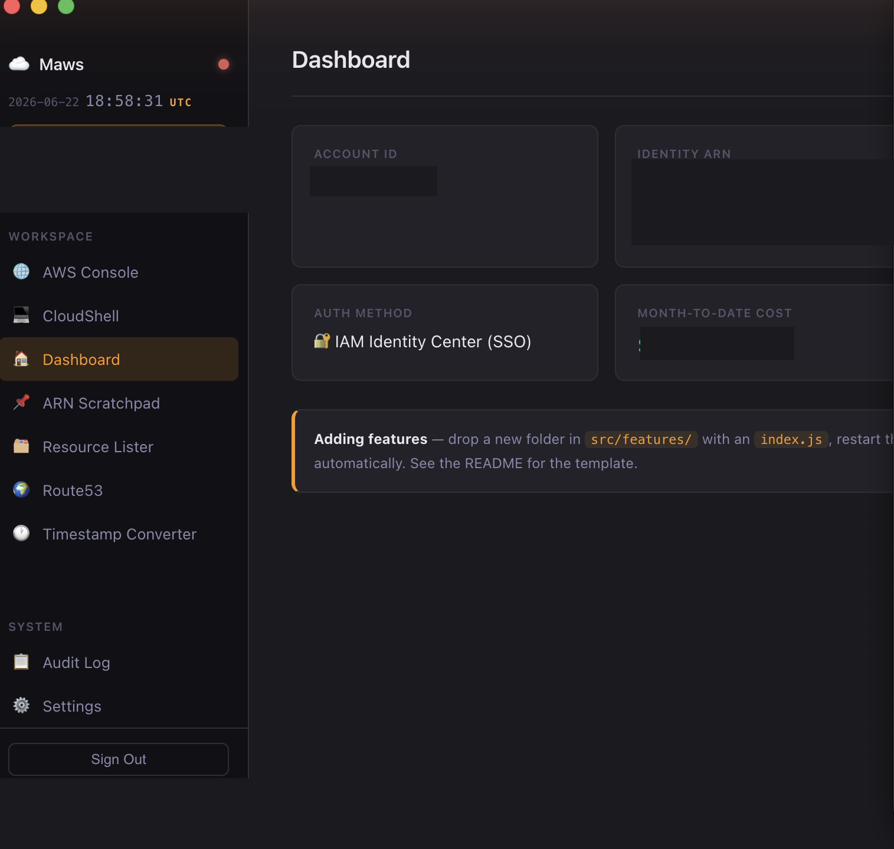
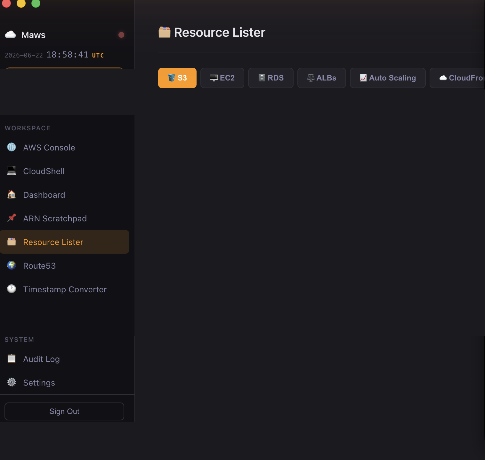
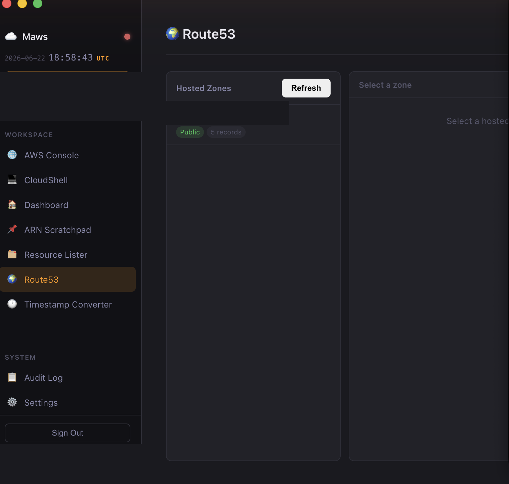
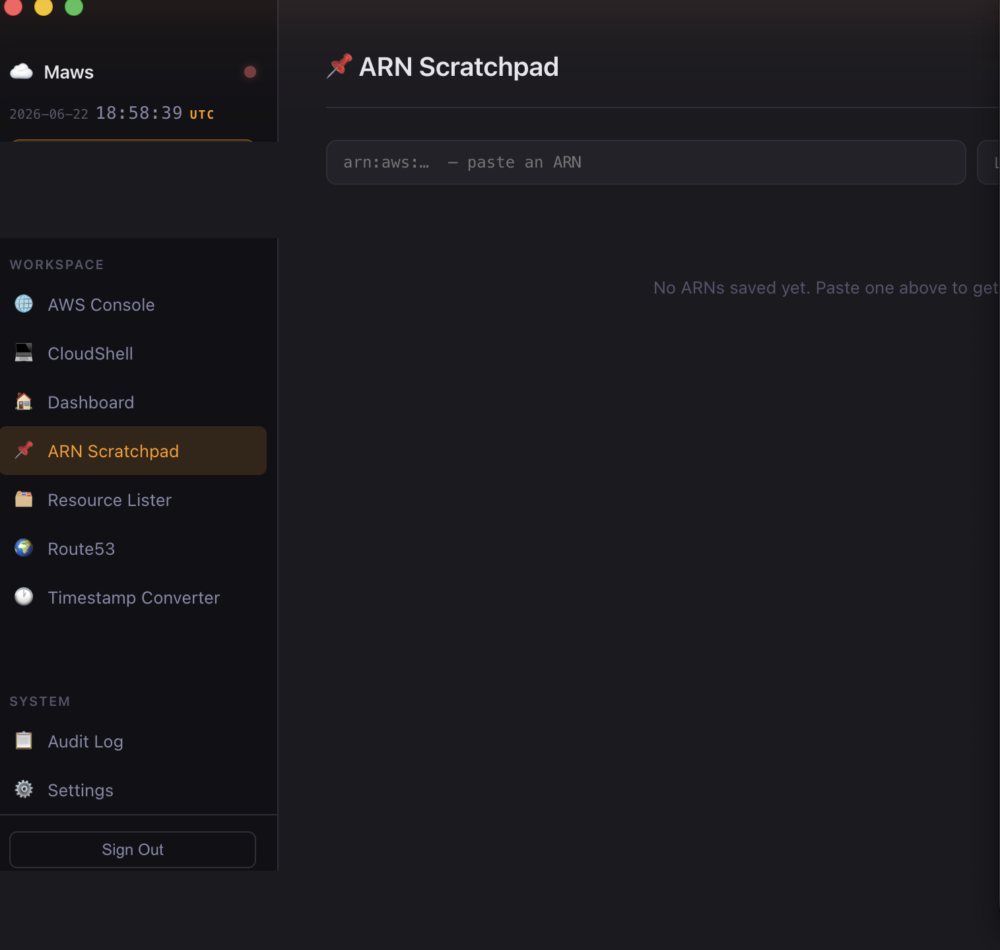
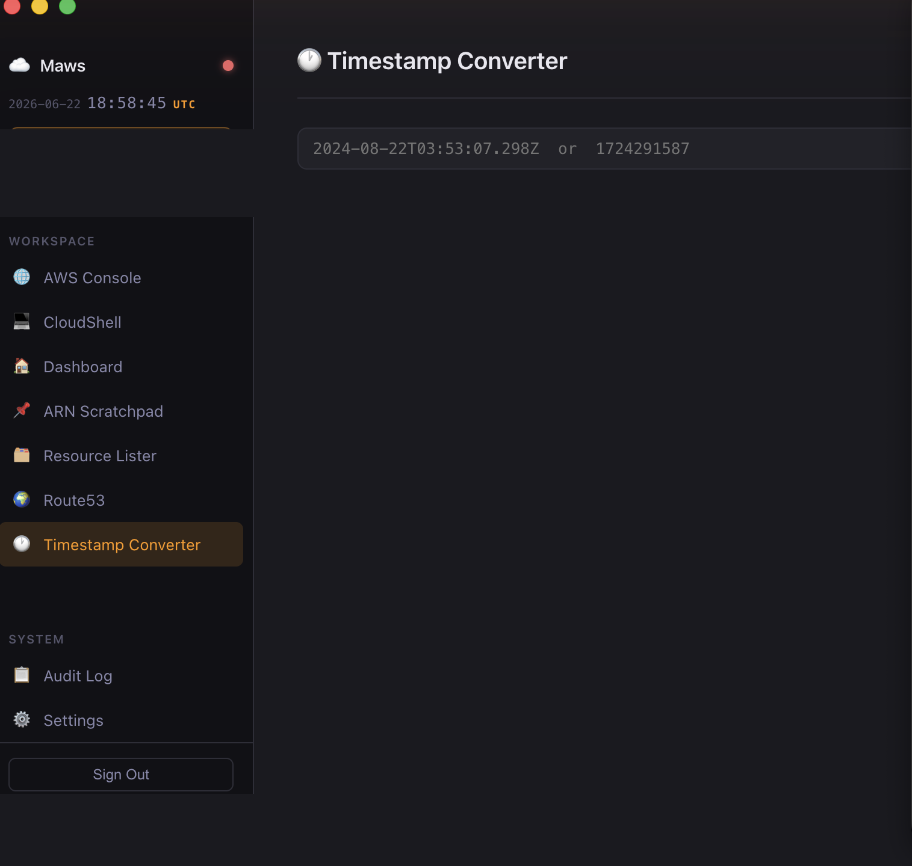
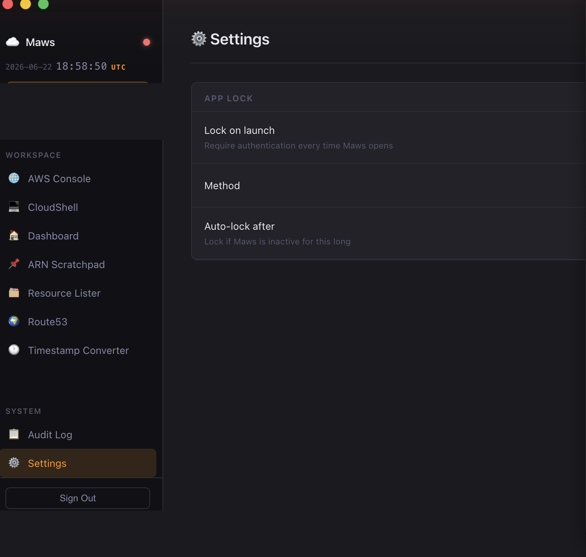

# ☁️ Maws

**A modular macOS desktop app for AWS power users.**  
Authenticate once via SSO or IAM profile, then access the AWS Console, CloudShell, cost tracking, ARN scratchpad, resource browser, Route53, and more — all from one native window.


---

## Screenshots

<p align="center">
  
  <br/><em>Dashboard — account info, auth method, and month-to-date cost at a glance</em>
</p>

<p align="center">
  
  <br/><em>Resource Lister — browse S3, EC2, RDS, ALBs, Auto Scaling, CloudFront, DynamoDB, SNS, IAM Roles, Security Groups, VPCs, and ACM Certs</em>
</p>

<p align="center">
  
  <br/><em>Route53 — view hosted zones and DNS records</em>
</p>

<p align="center">
  
  <br/><em>ARN Scratchpad — save, label, and one-click copy frequently used ARNs</em>
</p>

<p align="center">
  
  <br/><em>Timestamp Converter — convert between Unix timestamps, ISO 8601, and human-readable formats</em>
</p>

<p align="center">
  
  <br/><em>Settings — Touch ID or password app lock with configurable auto-lock timeout</em>
</p>

---

## Features

- **SSO login** via AWS IAM Identity Center — no long-lived credentials stored
- **Access key profiles** for IAM user credentials
- **Session persistence** — survives relaunches; credentials stored in the macOS Keychain, never as plain text
- **App lock** — Touch ID or password protection with configurable auto-lock timeout
- **Embedded AWS Console** — federated browser session from your API credentials
- **Embedded CloudShell** — terminal in the same authenticated session
- **Month-to-date cost** — live Cost Explorer display on the dashboard
- **ARN Scratchpad** — save, label, and one-click copy frequently used ARNs
- **Resource Lister** — browse 12 resource types: S3, EC2, RDS, ALBs, Auto Scaling, CloudFront, DynamoDB, SNS, IAM Roles, Security Groups, VPCs, ACM Certs
- **Route53** — view hosted zones and drill into DNS records
- **Timestamp Converter** — convert Unix timestamps and ISO 8601 dates instantly
- **Public IP display** — your current IP, click to copy
- **Audit log** — JSONL record of all auth events, exportable as CSV or JSON
- **Modular feature system** — drop a folder in `src/features/` and it appears in the sidebar automatically

---

## Installation

### Download (recommended)

1. Go to [**Releases**](https://github.com/r41n403/maws/releases)
2. Download the latest `Maws-x.x.x-arm64.dmg`
3. Open the DMG and drag Maws to Applications
4. Open Maws normally

The app is code-signed and notarized by Apple — no security exceptions needed.

### Build from source

Requires Node.js 18+ and macOS.

```bash
git clone https://github.com/r41n403/maws.git
cd maws
npm install        # also rebuilds native modules (keytar) for Electron
npm start          # run locally
npm run dev        # run with DevTools open
npm run build      # build a DMG → dist/Maws-x.x.x.dmg
```

---

## Security

Maws is designed to handle AWS credentials carefully:

| Data | Where it lives |
|---|---|
| SSO session tokens | macOS Keychain (via `keytar`) |
| IAM profile credentials | macOS Keychain (via `keytar`) |
| App lock password | `~/Library/Application Support/maws/settings.json` (PBKDF2-hashed, 0o600) |
| ARN scratchpad | `~/Library/Application Support/maws/arns.json` |
| Audit log | `~/Library/Application Support/maws/audit.jsonl` |
| AWS credentials files | `~/.aws/credentials` and `~/.aws/config` (standard AWS CLI locations) |

**Nothing sensitive is written to the project directory or committed to git.**  
The session was previously stored as a plain-text JSON file; it is now stored exclusively in the macOS Keychain. On first launch after upgrading, any legacy `session.json` is migrated automatically and then deleted.

Maws makes direct API calls to AWS endpoints only. There is no telemetry, no analytics, and no third-party data collection.

---

## Releasing a new version

```bash
# 1. Bump version in package.json
# 2. Commit and tag
git add package.json
git commit -m "chore: bump to v0.3.0"
git tag v0.3.0
git push origin main --tags
```

GitHub Actions builds the DMG on a macOS runner, code-signs it with a Developer ID certificate, and notarizes it with Apple. The signed DMG is published as a GitHub Release automatically. Every push to `main` also uploads a DMG artifact (kept 14 days) for testing builds without tagging.

---

## Adding a feature

Features are self-contained modules discovered automatically at startup — no registration needed.

### 1. Copy the template

```bash
cp -r src/features/example-resource-lister src/features/my-new-feature
```

### 2. Edit `src/features/my-new-feature/index.js`

```js
module.exports = {
  id: 'my-new-feature',       // unique kebab-case ID
  name: 'My New Feature',     // shown in sidebar
  icon: '🔍',
  description: 'Does X',

  handlers: {
    'my-new-feature:do-thing': async (_event, args) => {
      const provider = require('../../main/aws-auth').getCredentialProvider();
      if (!provider) return { ok: false, error: 'Not authenticated' };
      const credentials = await provider();
      // call AWS SDK here
      return { ok: true, data: [] };
    },
  },
};
```

### 3. Add the renderer view

In `src/renderer/app.js`, inside `buildFeatureView(feature)`:

```js
if (feature.id === 'my-new-feature') {
  return `
    <div class="view-header"><h2>${feature.icon} ${feature.name}</h2></div>
    <button class="btn btn-primary btn-sm" id="my-feature-btn">Run</button>
    <pre id="my-feature-output"></pre>
  `;
}
```

And inside `bindFeatureActions(feature, section)`:

```js
if (feature.id === 'my-new-feature') {
  section.querySelector('#my-feature-btn').addEventListener('click', async () => {
    const result = await window.aws.invoke('my-new-feature:do-thing', {});
    section.querySelector('#my-feature-output').textContent = JSON.stringify(result, null, 2);
  });
}
```

### 4. Restart

```bash
npm start
```

The new feature appears in the sidebar immediately.

### Calling the AWS SDK from a feature

```js
const { EC2Client, DescribeInstancesCommand } = require('@aws-sdk/client-ec2');
const awsAuth = require('../../main/aws-auth');

const credentials = await awsAuth.getCredentialProvider()();
const region = awsAuth.getRegion();
const ec2 = new EC2Client({ credentials, region });
const resp = await ec2.send(new DescribeInstancesCommand({}));
```

The credential provider always returns fresh credentials — SSO tokens refresh automatically.

---

## Project structure

```
maws/
├── .github/
│   └── workflows/
│       └── build.yml          # CI: build + sign + notarize DMG on push/tag
├── assets/
│   ├── icon.icns              # App icon
│   ├── entitlements.mac.plist # Hardened runtime entitlements
│   └── screenshots/           # README screenshots
├── src/
│   ├── main/
│   │   ├── index.js           # Electron main process + IPC handlers
│   │   ├── aws-auth.js        # SSO & profile auth, Keychain session cache
│   │   ├── cost-checker.js    # Cost Explorer month-to-date query
│   │   ├── audit-logger.js    # JSONL audit log writer
│   │   ├── health-checker.js  # AWS connectivity health check
│   │   ├── settings.js        # App lock settings (persisted locally)
│   │   └── feature-registry.js # Auto-loads src/features/*/index.js
│   ├── features/
│   │   ├── arn-scratchpad/    # ARN save/copy/label feature
│   │   ├── resource-lister/   # Browse 12 AWS resource types
│   │   ├── route53/           # Hosted zones and DNS records
│   │   ├── timestamp-converter/ # Unix/ISO timestamp conversion
│   │   └── example-resource-lister/  # Template — copy to add features
│   ├── renderer/
│   │   ├── index.html         # App shell
│   │   ├── app.js             # UI logic, navigation, feature views
│   │   └── styles.css         # Dark-mode UI styles
│   └── preload.js             # Secure contextBridge (window.aws.*)
├── electron-builder.yml       # DMG packaging + code signing config
└── package.json
```

---

## License

MIT
